# An input-only difficulty score for active-learning selection of proton pencil-beam dose calculations

*Technical report. The report follows the structure motivation (Section 1), methods (Section 2), results (Section 3), discussion (Section 4) and conclusion (Section 5). Abbreviations are introduced at first use and collected implicitly through the text; every figure and table is self-contained through its caption.*

---

## Abstract

A transformer neural network for proton dose prediction, referred to here as ADoTA, reproduces the dose of a single proton pencil beam ("beamlet") in milliseconds, replacing a Monte Carlo (MC) simulation that takes seconds to minutes. Improving the network requires additional training examples, and each example requires one expensive MC simulation; active learning reduces this cost by simulating only the beamlets the network predicts poorly. Selecting those beamlets before simulation requires a difficulty score computed from the model inputs alone, because the dose does not yet exist. This report defines such a score as a weighted sum of physics-motivated heterogeneity metrics, fits it offline against the model error under five-fold patient-grouped cross-validation, and confirms it on a frozen test set of seven patients excluded from all fitting, drawn from a reference set of 69,290 beamlets from 56 patient computed-tomography (CT) scans. On the frozen test set the score reaches a Pearson correlation of 0.85 and a Spearman correlation of 0.86 with the relative dose error (RDE); an interpretable 14-metric version reaches 0.79 and 0.82 respectively. The gamma pass rate (GPR), the clinically primary quality metric, is predictable only to 0.71, which we attribute to its concentration in a small failure tail. The score is physically interpretable: prediction error grows with beam path length and with the amount of tissue heterogeneity along the path. We conclude that an input-only score predicts the continuous dose error strongly enough to drive active-learning selection, and we identify model predictive uncertainty as the next signal to add. *An erratum dated 2026-09-07 follows this abstract: the score as fitted here located the Bragg peak from the Monte Carlo dose; the deployed input-only version, refit on an analytic dose, reaches 0.879 and 0.906 on the beamlets to which it applies.*

---

## Erratum (2026-09-07)

Four statements in this report are corrected here; the corrected passages below carry a marker pointing back to this section. The underlying analysis is experiment record EXP-0006, and the code is `src/acquisition/` in the repository.

1. **The score, as fitted, was not input-only.** Section 2.3 states that no metric uses the dose. In the reference pipeline 28 of the 30 metrics use the Monte Carlo dose: to locate the Bragg peak (the depth zone of Section 2.3.5, the peak slice $s^\star$, and the lateral peak voxel around which the spheres of Sections 2.3.3 and 2.3.4 are built), and, for `sobel_dw_*`, `sobel_th_*`, `lateral_edge_energy` and `max_grad_depth_mm`, as the weighting or the quantity itself. Only `energy_mev` and `ct_max_hu` were computed from the inputs alone. The statement in Section 2.3.5 that the zone bounds are obtained from the beam energy in deployment described an intention that had not been implemented.

2. **`max_grad_depth_mm` is not a density gradient.** It is the depth of the steepest gradient of the integrated depth-dose curve, that is the proximal rise of the Bragg peak, a dose-derived range proxy.

3. **A third of the reference set has no Bragg peak inside the crop.** For 35 percent of the 69,290 beamlets (65 percent of thorax beamlets stop inside; the rest cross lung or air and leave the 320 mm crop) the "peak" the pipeline located is the entrance maximum of a decaying plateau, so the zone and sphere metrics of those records describe the wrong place. The correlations of Section 3 were fitted through them. Restricted to beamlets whose peak lies inside the crop, the same protocol gives, for the 30-metric linear score, a frozen-test Pearson of 0.925 and Spearman of 0.943 (14-metric: 0.900 and 0.929).

4. **The input-only score now exists and is the deployed one.** An analytic pencil-beam dose (per-ray water-equivalent depth from the MCsquare-calibrated stopping power, Bortfeld's Bragg curve at the Grevillot range, straggled with the beam model's energy spread, weighted by the flux) replaces the Monte Carlo dose wherever the metrics used it, and the score is refit under the protocol of Section 2.2. The analytic dose agrees with the Monte Carlo dose on whether a beam stops inside the crop for 97.2 percent of beamlets, and locates the peak within 4 mm for 70 percent of those that do. On beamlets whose peak lies inside the crop, the refit 30-metric score reaches a frozen-test Pearson of **0.879** and Spearman of **0.906** (14-metric: 0.867 and 0.901; non-linear reference 0.921 and 0.937), and it transfers across the two anatomies better than the sparse one (leave-one-anatomy-out Pearson 0.755 against 0.730), so it is the deployed selector. Over all records, including those without a peak in the crop, the analytic score reaches 0.821 and 0.831. The cost of not knowing where the dose peaks is therefore 0.03 to 0.05 in Pearson correlation; the headline claim of the abstract, an input-only score above 0.85 on unseen patients, holds for the population to which such a score is applicable.

---

## 1. Introduction

### 1.1 Background and motivation

ADoTA predicts the three-dimensional dose of a single proton pencil beam inside a patient directly from the patient CT scan and the beam geometry. A pencil beam, or beamlet, is a thin proton beam at a fixed energy, direction and spot position; its water-equivalent range, meaning the depth at which it stops, is set by its energy, and it deposits most of its dose in a sharp maximum at the end of its path called the Bragg peak. A clinical treatment combines thousands of such beamlets. The reference physics engine, MCsquare, computes the dose by MC simulation and is treated here as ground truth; it is accurate but slow, whereas ADoTA reproduces the dose in milliseconds.

Improving the network requires more training beamlets, and generating each one requires a costly MC simulation. Active learning addresses this cost by simulating only the most informative beamlets, that is, the ones the current network predicts poorly, rather than sampling at random. The central difficulty is temporal: to decide which beamlets to simulate, the selection must act before the dose exists, so it can use only the model inputs, namely the CT scan and the beam flux. This report addresses the construction of a difficulty score from those inputs alone.

### 1.2 Aim of this report

The report has three aims. The first aim is to define a difficulty score as an interpretable function of input-derived physics metrics and to describe how it is fitted. The second aim is to determine which measure of model error is predictable from the inputs, because different error definitions carry different amounts of predictable signal. The third aim is to validate the score on unseen patients and to interpret it physically, so that it can be defended as a selection rule rather than accepted as a black box.

---

## 2. Materials and methods

### 2.1 Reference dataset, model and problem illustration

The reference dataset is a single evaluation run of ADoTA over 69,290 beamlets extracted from 56 patient CT scans spanning two anatomical regions, the thorax and the pelvis or abdomen. For every beamlet the run stored the beam energy in mega-electronvolts (MeV), a set of input-derived heterogeneity metrics defined in Section 2.3, and several measures of the model error against the MCsquare ground truth, defined in Section 2.5.

Figure 1 illustrates the prediction problem on one representative heterogeneous beamlet and establishes the central observation that motivates the study. The model reproduces the ground-truth dose closely, and the residual error is small and concentrated near the Bragg peak, in the region where the beam traverses heterogeneous tissue. Consequently the informative beamlets for active learning form a small tail, and the task of the difficulty score is to identify that tail from the inputs.

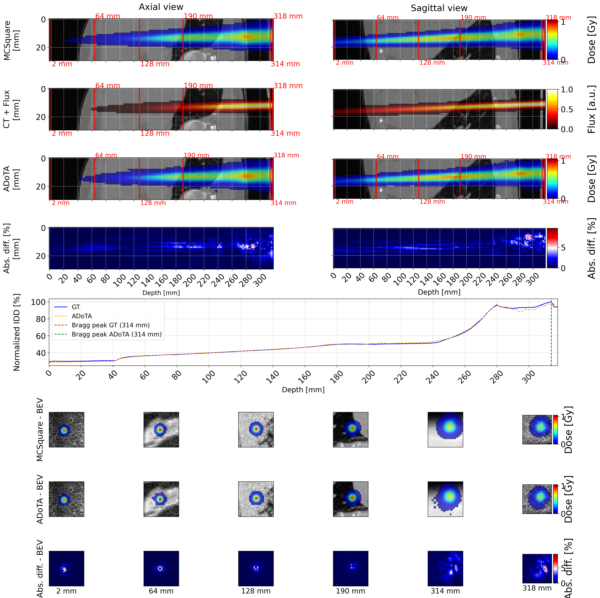

**Figure 1.** One representative heterogeneous beamlet; the beam enters at the left and stops at the Bragg peak near 314 mm. From top to bottom the rows show the Monte Carlo ground-truth dose in gray (grey scale) overlaid on the computed-tomography image; the model input, that is the computed-tomography image with the proton flux overlaid in orange (this row is the only information available to the network); the ADoTA prediction; the absolute dose difference in percent of the maximum dose; the integrated depth-dose profile of ground truth and prediction with the Bragg-peak positions marked; and beam's-eye-view slices at six depths. The prediction closely matches the ground truth, and the residual error concentrates near the Bragg peak.

The difficulty of a beamlet varies strongly with its geometry and range, and Figure 2 contrasts the two extremes that the score must separate. In the easy case (a) a beam of 108 mega-electronvolts stops at a range of 149 mm within near-homogeneous tissue: the Bragg peak is sharp, the predicted range agrees with the ground truth to within 0.8 mm, and the gamma pass rate is 99.9 percent. In the hard case (b) a beam of 157 mega-electronvolts crosses sixteen distinct tissue regions on its way to a range of 218 mm: the predicted Bragg peak is broadened and falls 3.6 mm short of the ground truth, and the gamma pass rate falls to 85.8 percent. The relative dose error differs by an order of magnitude between the two beamlets, from 0.04 to 0.47. The two therefore carry very different value for active learning: the hard beamlet is informative and worth simulating, whereas the easy beamlet is already predicted well and a simulation of it would be wasted. Separating the two from the inputs alone, before any dose exists, is the task of the difficulty score.

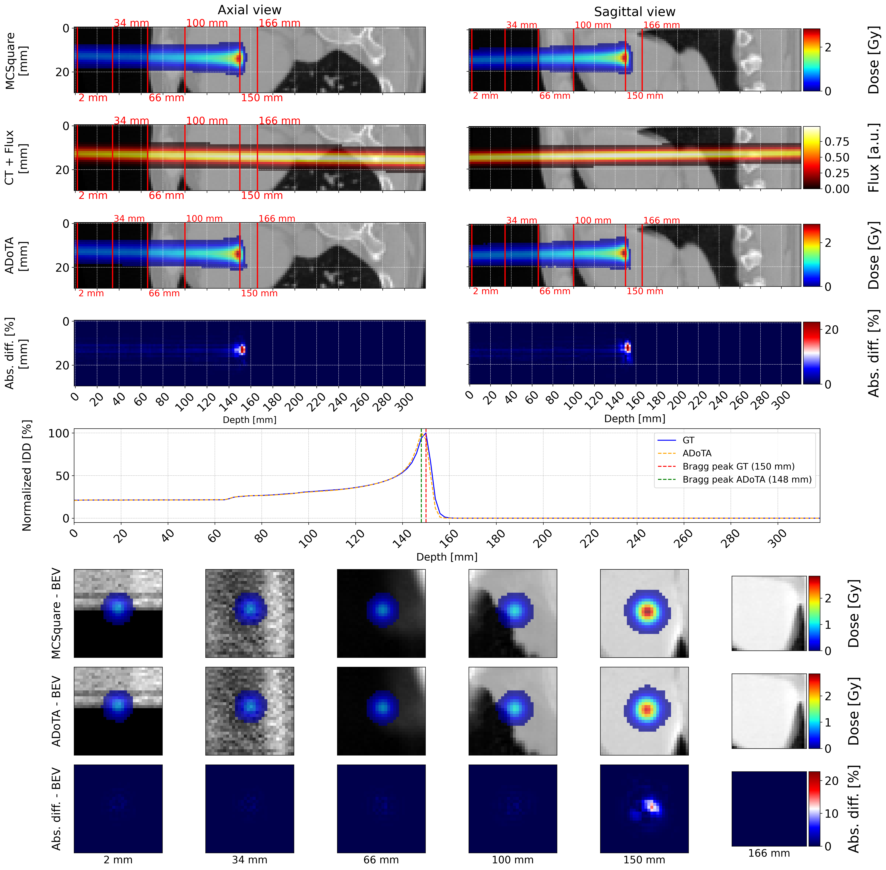

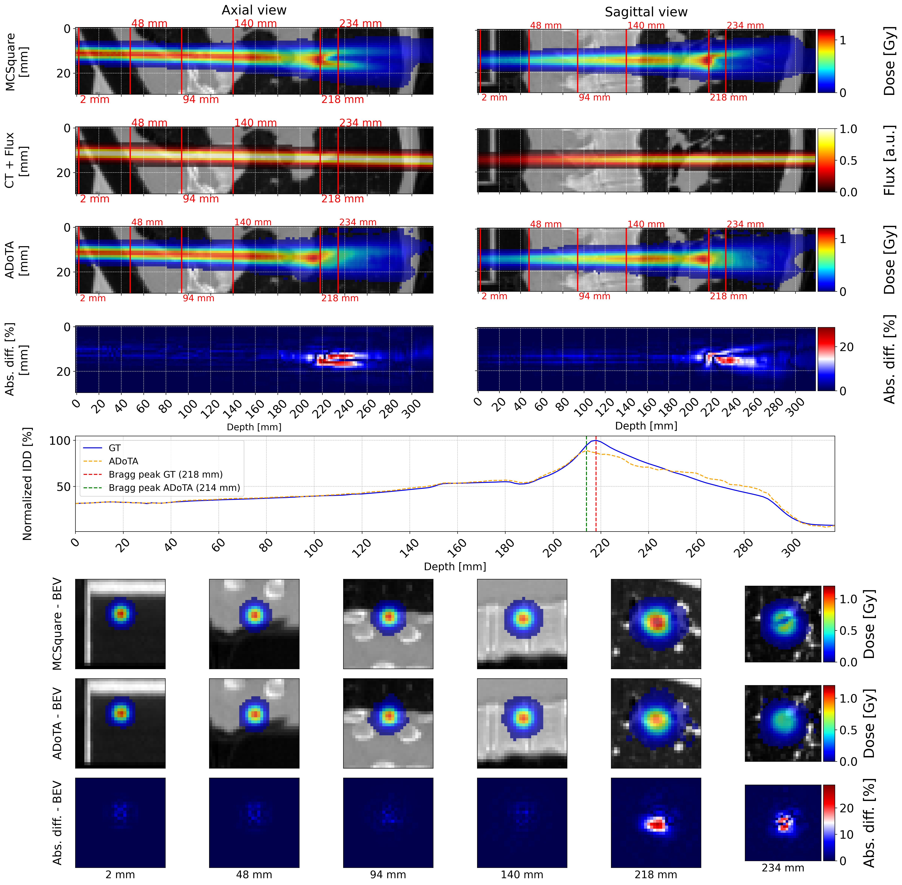

**Figure 2.** Two thorax beamlets at opposite ends of the difficulty range, each in the layout of Figure 1 (ground truth, input, ADoTA prediction, absolute difference, depth-dose profile and beam's-eye views). (a) An easy beamlet of 108 mega-electronvolts that stops at 149 mm in near-homogeneous tissue: the depth-dose profiles of ground truth and prediction coincide, the Bragg-peak positions agree to within 0.8 mm, the relative dose error is 0.04, and the gamma pass rate is 99.9 percent. (b) A hard beamlet of 157 mega-electronvolts that crosses sixteen tissue regions to a range of 218 mm: the predicted Bragg peak is broadened and falls 3.6 mm short, the error is large along the heterogeneous path, the relative dose error is 0.47, and the gamma pass rate is 85.8 percent.

Figure 3 decomposes the same heterogeneous beamlet of Figure 1 into the physical quantities from which the difficulty score is built, and shows that the error-prone region coincides with tissue heterogeneity. The beam traverses lung, soft tissue and bone; the sharp density transitions and the amount of tissue variation along the path are the quantities that the metrics in Section 2.3 measure.

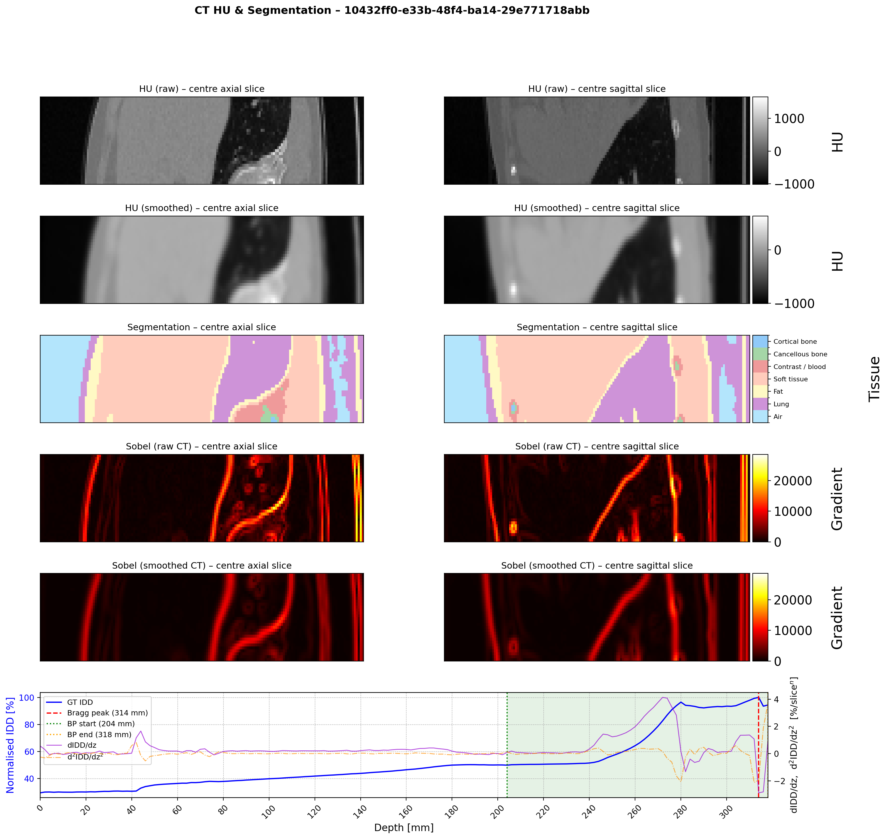

**Figure 3.** Decomposition of the beamlet of Figure 1 into input-derived quantities. The rows show the computed-tomography image in Hounsfield units (HU), a smoothed version, the tissue-class segmentation (air, lung, fat, soft tissue, blood, cancellous bone and cortical bone), the Sobel edge-magnitude maps, and the integrated depth-dose profile with the Bragg-peak region shaded. The beam crosses several tissue types; this heterogeneity is what the difficulty metrics quantify.

### 2.2 Formulation and fitting of the difficulty score

The difficulty score is a weighted sum of percentile-normalized, input-derived metrics. Let $x$ denote a candidate beamlet, let $m_k(x)$ denote the $k$-th input metric for $k=1,\dots,K$, and let $p_k(x)=\hat{F}_k\!\big(m_k(x)\big)\in[0,1]$ denote the percentile rank of that metric within the reference pool, where $\hat{F}_k$ is the empirical cumulative distribution function of metric $k$. The score is

$$
\mathrm{diff\_score}(x) \;=\; b \;+\; \sum_{k=1}^{K} w_k\, p_k(x),
$$

where $w_k$ are the metric weights and $b$ is an intercept. A higher score denotes a harder beamlet. The percentile transform places metrics measured in different units, such as Hounsfield units, millimetres and dimensionless edge energies, on the common interval $[0,1]$ and is robust to outliers; the transform $\hat{F}_k$ is stored as part of the frozen model.

The weights are learned offline, on beamlets that have already been simulated, by regression against the model error. Equation for the fit is

$$
(\hat{w},\hat{b}) \;=\; \arg\min_{w,b}\; \sum_{x}\Big(y(x)-b-\sum_{k=1}^{K} w_k\, p_k(x)\Big)^{2} \;+\; \alpha\,\Omega(w),
$$

where $y(x)$ is the regression target defined in Section 2.5, $\alpha\ge 0$ is the penalty strength, and $\Omega(w)$ is a penalty on the weights. Two penalties are used: the squared Euclidean norm $\Omega(w)=\lVert w\rVert_2^2$ (ridge regression), which retains all metrics, and the sum of absolute weights $\Omega(w)=\lVert w\rVert_1$ (least absolute shrinkage and selection operator, Lasso), which drives small weights to exactly zero and therefore performs metric selection. The model error metrics enter only here, as the target $y$; they are never evaluated at scoring time.

The score is validated with a frozen test set of whole patients, so that the reported performance describes generalization to patients seen neither during fitting nor during model selection. Seven of the 56 patients, comprising 7,938 beamlets, that is 11.5 percent of the reference set, were selected at random once, stratified by anatomy into five thorax patients and two pelvis-or-abdomen patients, and frozen as the test set; they were used only for the single final evaluation. On the remaining 49 patients, which form the development pool, all model development used five-fold cross-validation in which whole patients are held out in each fold, so that the development estimate is itself free of beamlet-level leakage across patients. The final model was fitted once on the entire development pool, and its frozen weights were evaluated a single time on the test set. The percentile transform $\hat{F}_k$ was fitted on the training rows alone at every stage, so no information from the held-out data entered the fit. Once fitted, the score is frozen as the triple $\{w_k, b, \hat{F}_k\}$; scoring a new beamlet then requires only its input metrics and no dose information.

The whole-patient test set measures generalization to unseen patients, which is the stricter of two possible regimes. An alternative test set, stratified within each patient rather than by whole patients, would instead measure generalization to new beamlets of already-seen patients, which is the relevant regime when additional beamlets are drawn from the existing patient pool. The whole-patient test reported here is the more conservative choice, because the test patients share no data with the training pool. The frozen test set was reserved for the final verification of the score in Section 3.2; the exploratory analyses of which error target is predictable (Section 3.1) and of the effect of the target transform (Table 4) were likewise computed on the development pool of 49 patients under patient-grouped cross-validation, so that the seven frozen-test patients contributed to no analysis reported here and the test set remained untouched until the single final evaluation.

### 2.3 Input metrics

Every metric is computed from the CT image, the beam flux and the beam energy, once the Bragg peak has been located. In the reference pipeline the peak was located from the Monte Carlo dose, which also weights the `sobel_dw_*` and `sobel_th_*` metrics; the deployed version locates it from an analytic dose built from the same three inputs (see Erratum, items 1 and 4). Table 1 lists the metrics grouped by physical family, states in one line what each family measures, and points to the subsection that defines it. The remainder of this subsection defines each family precisely and illustrates it.

**Table 1.** Overview of the input-derived metrics that enter the difficulty score, grouped by physical family. Water-equivalent path length is abbreviated WEPL, relative stopping power RSP, and the interface severity index ISI. The final column gives the subsection in which each family is defined.

| Physical family | Metrics | Quantity measured | Defined in |
|---|---|---|---|
| Density along the beam | `sigma_hu_bp`, `total_hu_change`, `max_hu_jump`, `max_hu_gradient`, `hetero_fraction`, `n_density_regions`, `interface_bp_distance` | how tissue density changes along the beam path | Section 2.3.1 |
| Water-equivalent path length | `wepl_mean`, `wepl_std`, `pflugfelder_hi` | depth in water to the Bragg peak, and its variation across the beam width | Section 2.3.2 |
| Tissue edges | `sum_sobel_bp`, `p95_sobel_bp`, `mean_sobel_axial`, `lateral_edge_energy`, `sobel_dw_anisotropy`, `sobel_th_anisotropy`, `sobel_dw_beam_angle`, `sobel_th_beam_angle`, `sobel_dw_edge_energy`, `sobel_th_edge_energy` | strength, sharpness and orientation of the tissue boundaries the beam crosses | Section 2.3.3 |
| Interface severity | `isi_sum`, `isi_max`, `isi_mean`, `isi_axial_sum` | number and severity of tissue-class interfaces along the path | Section 2.3.4 |
| Lateral spread and range | `lateral_hu_var_bp`, `bp_range_min_mm`, `bp_range_max_mm`, `max_grad_depth_mm` | lateral density spread at the peak, and beam depth | Section 2.3.5 |
| Beam parameter | `energy_mev` | beam energy, which sets the nominal range | Section 2.2 |

Notation for the metric definitions is as follows. Let $C_{s,i,j}$ denote the CT value in Hounsfield units at depth slice $s$ and lateral position $(i,j)$, and let $\Phi_{s,i,j}$ denote the beam flux at that voxel. The beam travels along the depth axis indexed by $s$. Let $\Omega_s$ denote the beam footprint at slice $s$, defined as the voxels whose flux is at least ten percent of the maximum flux in that slice, and let $\Delta z = 2\ \mathrm{mm}$ denote the slice thickness. Let $s^\star$ denote the Bragg-peak slice. Unless stated otherwise, the metrics are computed within the Bragg-peak zone, an interval of depth slices around $s^\star$.

#### 2.3.1 Density along the beam

The beam is first collapsed to a one-dimensional profile of flux-weighted mean density per depth slice,

$$
H_s = \frac{\sum_{(i,j)\in\Omega_s}\Phi_{s,i,j}\,C_{s,i,j}}{\sum_{(i,j)\in\Omega_s}\Phi_{s,i,j}}\ \ [\mathrm{HU}].
$$

The profile $H_s$ is segmented into contiguous tissue regions, indexed by $r$, with mean values $\bar{H}_r$. The metrics of this family summarize the profile and its segmentation:

$$
\texttt{sigma\_hu\_bp}=\operatorname{std}_s H_s,\qquad
\texttt{max\_hu\_gradient}=\max_s\lvert H_{s+1}-H_s\rvert,
$$
$$
\texttt{total\_hu\_change}=\sum_r\lvert \bar{H}_r-\bar{H}_{r-1}\rvert,\qquad
\texttt{max\_hu\_jump}=\max_r\lvert \bar{H}_r-\bar{H}_{r-1}\rvert,
$$
$$
\texttt{hetero\_fraction}=1-\frac{\max_c \#\{s:\operatorname{class}(H_s)=c\}}{N_{\mathrm{slices}}},
$$

where $c$ indexes tissue classes and $N_{\mathrm{slices}}$ is the number of slices in the Bragg-peak zone. The metric `n_density_regions` counts the contiguous tissue regions, and `interface_bp_distance` is the distance in slices from the nearest tissue transition to the Bragg peak. Figure 4 shows these quantities on the beamlet of Figure 1.

Proton dose depends on the sequence of densities the beam crosses, and sharp transitions between bone, soft tissue, lung and air are the locations where range and dose are hardest to predict. Accordingly, `total_hu_change` and `max_hu_jump` measure how many and how severe the transitions are, `hetero_fraction` measures how mixed the path is, and `interface_bp_distance` measures whether a transition falls at the sensitive Bragg peak.

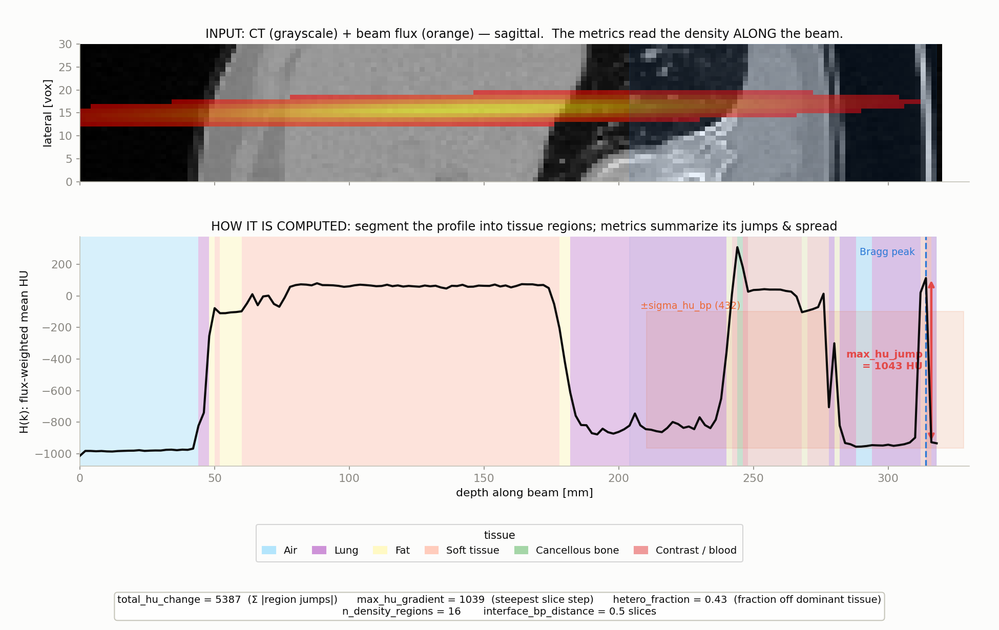

**Figure 4.** The density-along-the-beam metrics for the beamlet of Figure 1. Top: the input computed-tomography image with the proton flux overlaid (sagittal view; the beam runs from left to right). Bottom: the flux-weighted mean density per depth slice, $H_s$, with the tissue regions shaded and the derived metrics annotated. The beam runs through soft tissue, drops into lung near minus 850 Hounsfield units, and meets a bone transition of 1043 Hounsfield units at the peak, so this is a difficult beamlet.

#### 2.3.2 Water-equivalent path length

The water-equivalent path length (WEPL) measures how much water the beam effectively crosses to reach the Bragg peak. Let $\rho(C)$ denote the mass density corresponding to a CT value $C$, let $S_{\mathrm{mat}}(C,E)$ denote the material stopping power at energy $E$ and $S_{\mathrm{water}}(E)$ the stopping power of water, and define the relative stopping power (RSP) as $\mathrm{RSP}(C)=\rho(C)\,S_{\mathrm{mat}}(C,E)/S_{\mathrm{water}}(E)$. The relative stopping power is evaluated at a fixed reference energy of $E=100$ MeV, following the MCsquare convention with which the ground-truth dose was generated; the proton's own energy loss along the path is deliberately not tracked. This is justified because the material-to-water stopping-power ratio is nearly energy-independent over the therapeutic proton energy range: in the Bethe stopping-power formula the energy-dependent term is common to the material and to water and largely cancels in the ratio, so the ratio is flat to about one percent from the highest clinical energies down to roughly 10 MeV. The WEPL therefore depends only on the tissue crossed and the beam geometry, not on the proton's local energy, and can be computed from the CT alone; this energy-independence is exactly what makes the water-equivalent path length a well-defined input-only quantity. The WEPL of the lateral ray $(i,j)$ is the depth-integrated relative stopping power to the Bragg peak,

$$
W_{i,j}=\Delta z\sum_{s\le s^\star}\mathrm{RSP}(C_{s,i,j})\ \ [\mathrm{mm}],\qquad
\texttt{wepl\_mean}=\operatorname{mean}_{\Omega}W,\qquad
\texttt{wepl\_std}=\operatorname{std}_{\Omega}W,
$$

where the mean and standard deviation are taken over the beam footprint. The metric `pflugfelder_hi` is the Pflugfelder heterogeneity index, defined as the coefficient of variation of the WEPL, that is $\texttt{wepl\_std}/\texttt{wepl\_mean}$, and is therefore a normalized measure of the same lateral spread. Figure 5 shows the computation of these metrics.

A proton stops where its integrated stopping power reaches its range, so `wepl_mean` is the effective depth in water of the peak. If the WEPL varies across the beam width, quantified by `wepl_std`, different parts of the beam stop at different depths, the distal edge of the dose smears, and the dose there becomes intrinsically hard to predict. This is the situation in which one part of the beam passes through bone while another passes through air.

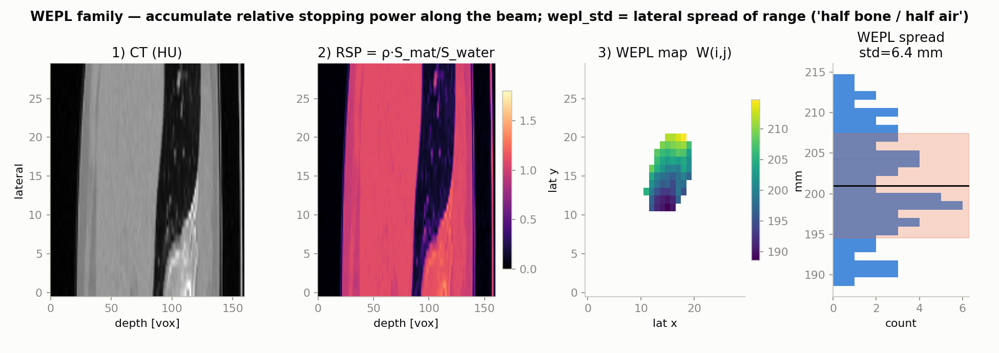

**Figure 5.** Computation of the water-equivalent path length (WEPL) metrics for the beamlet of Figure 1. From left to right: the computed-tomography image in Hounsfield units; the relative stopping power computed voxel by voxel; the WEPL map obtained by integrating the relative stopping power along the beam to the Bragg peak, shown across the beam footprint; and the distribution of WEPL values across the footprint, whose standard deviation is `wepl_std`.

Figure 6 demonstrates that the model error increases with the WEPL spread, and thereby justifies the metric. Three beamlets of similar energy near 160 MeV are ordered by `wepl_std`; Table 2 lists their metric values and errors. As the WEPL spread increases, the Bragg peak broadens and shifts, and the gamma pass rate falls from 100 percent to 84 percent.

**Table 2.** Three beamlets of similar energy (near 160 MeV) ordered by the water-equivalent path length spread `wepl_std`, shown in Figure 6. The gamma pass rate (GPR) is the percentage of voxels agreeing within 3 percent and 3 mm, and the relative dose error (RDE) is the mean absolute error normalized by the maximum dose. As the spread increases the prediction degrades.

| Case | `wepl_std` [mm] | Gamma pass rate [%] | Relative dose error [%] | Observation |
|---|---|---|---|---|
| Low | 1.2 | 100 | 0.10 | uniform path, sharp Bragg peak, prediction and ground truth overlap |
| Medium | 5.3 | 88 | 0.41 | mixed path, broadened peak, small errors near the peak |
| High | 13.7 | 84 | 0.48 | heterogeneous path, peak smears and shifts by 2 mm, large distal error |

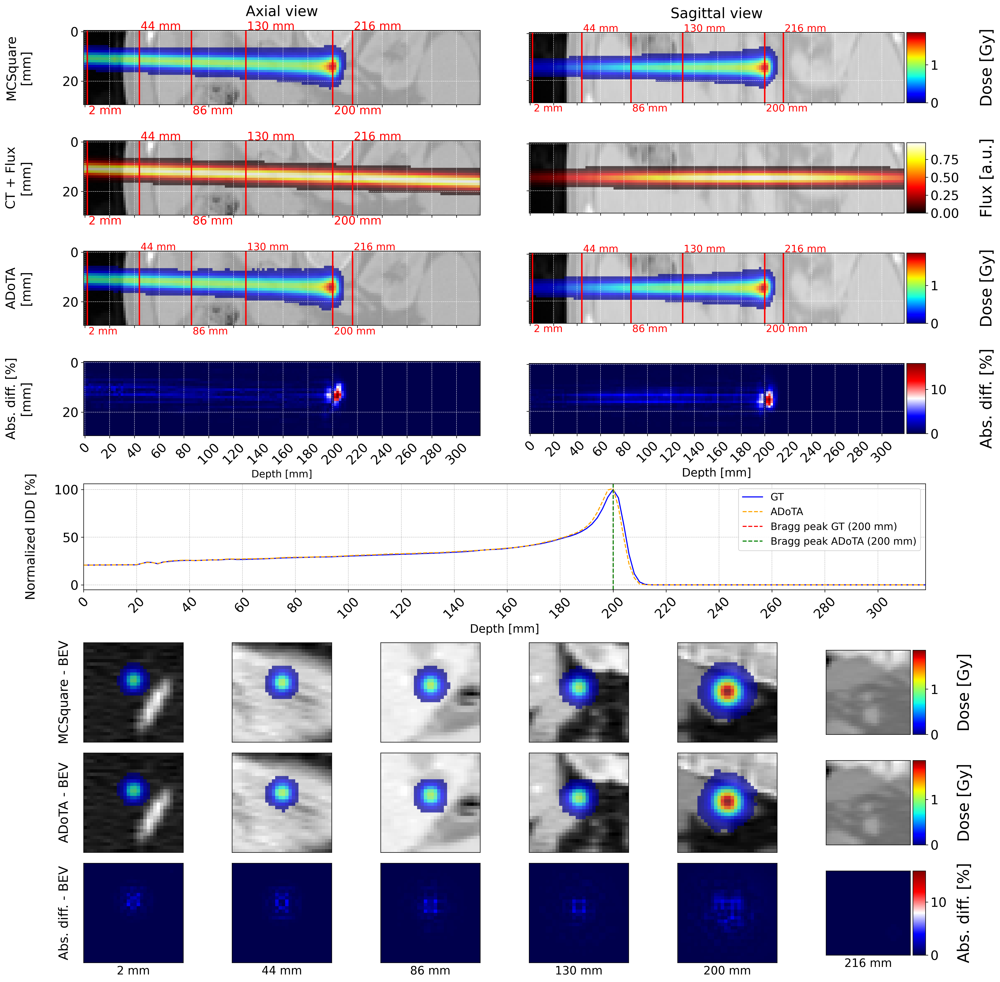

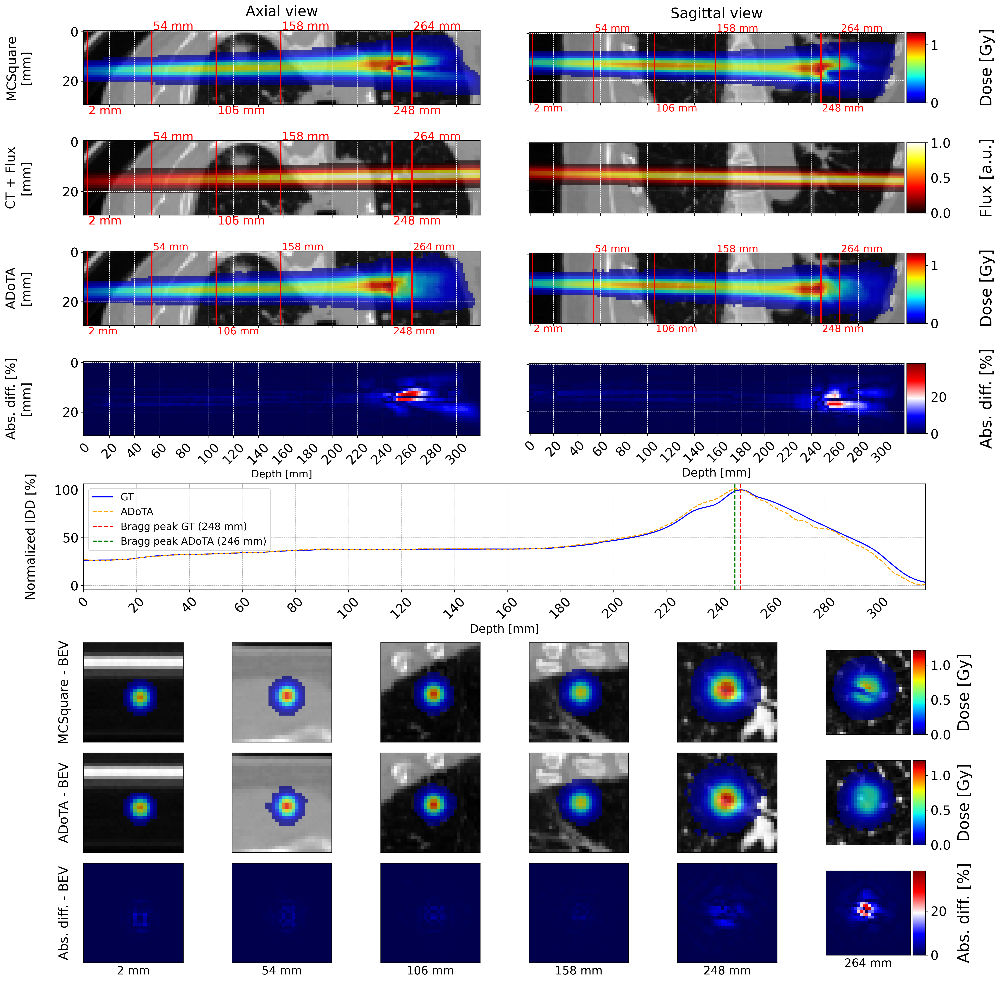

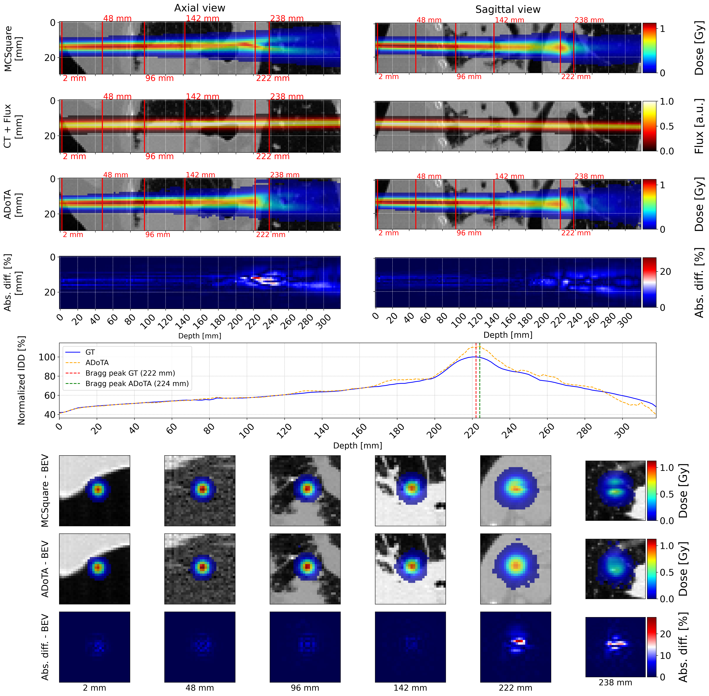

**Figure 6.** Three beamlets of similar energy ordered by increasing water-equivalent path length spread, corresponding to the rows of Table 2: (a) low spread of 1.2 mm, (b) medium spread of 5.3 mm, (c) high spread of 13.7 mm. Each panel has the layout of Figure 1 (ground truth, input, ADoTA prediction, absolute difference, depth-dose profile and beam's-eye views). In the low-spread case the depth-dose profiles of ground truth and prediction coincide and the Bragg-peak positions agree; in the high-spread case the predicted Bragg peak overshoots and shifts from 222 mm to 224 mm, and the distal error is large, so the gamma pass rate falls to 84 percent.

#### 2.3.3 Tissue edges

Sharp density transitions are quantified with a three-dimensional Sobel gradient of the CT image. Let $\nabla C=(G_z,G_y,G_x)$ denote the Sobel gradient with components along the depth and the two lateral axes, and let $\lvert\nabla C\rvert=\sqrt{G_z^2+G_y^2+G_x^2}$ denote its magnitude. Two metrics summarize the edge burden within the Bragg-peak zone,

$$
\texttt{sum\_sobel\_bp}=\!\!\sum_{v\in\Omega_{\mathrm{BP}}}\!\!\lvert\nabla C\rvert_v,\qquad
\texttt{p95\_sobel\_bp}=Q_{95}\!\big(\lvert\nabla C\rvert\big),
$$

where $v$ indexes voxels in the Bragg-peak footprint $\Omega_{\mathrm{BP}}$ and $Q_{95}$ denotes the ninety-fifth percentile. The orientation of the edges is obtained from the structure tensor $J=\langle\nabla C\,\nabla C^{\top}\rangle$, whose eigenvalues are $\lambda_1\ge\lambda_2\ge\lambda_3$ with principal eigenvector $v_1$. From the structure tensor we define the edge energy $\operatorname{tr}(J)=\lambda_1+\lambda_2+\lambda_3$, the anisotropy $A=(\lambda_1-\lambda_3)/(\lambda_1+\lambda_2+\lambda_3)\in[0,1]$, which is zero for isotropic edges, and the orientation $\theta=\arccos\lvert v_1\cdot\hat{z}\rvert$, where $\hat{z}$ is the beam direction. The metric `lateral_edge_energy` isolates the edges that lie across the beam,

$$
\texttt{lateral\_edge\_energy}=\operatorname{tr}(J)\,\sin^2\theta .
$$

The metrics `mean_sobel_axial`, `sobel_dw_*` and `sobel_th_*` are variants of these quantities computed with dose weighting and with threshold masking, respectively.

Figure 7 explains the anisotropy and the orientation on idealized phantoms and is the key to interpreting these metrics. Figure 8 then shows on real beamlets that the model error grows with the edge burden. Proton dose errors localize where the density changes sharply, because multiple scattering and range mixing occur there; the edge metrics therefore quantify how strong and how numerous these boundaries are. The orientation matters as well, because edges lying across the beam cause range mixing, whereas edges lying along the beam are crossed cleanly.

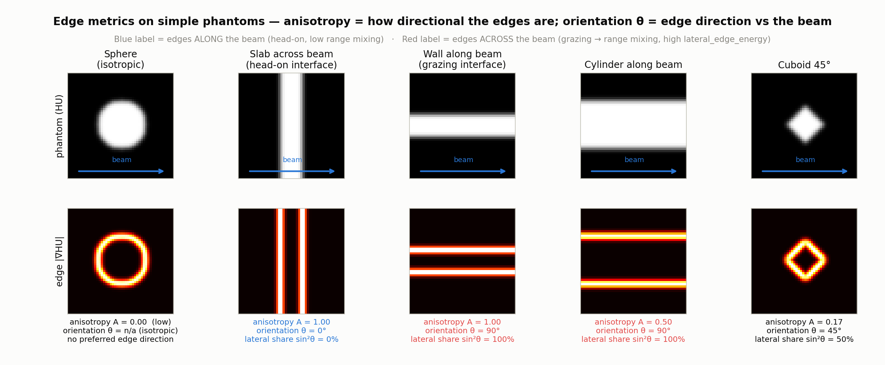

**Figure 7.** Interpretation of the edge orientation and anisotropy on idealized phantoms, each a bone-density object in soft tissue with the beam running from left to right. For each phantom the top row shows the object, the bottom row shows the Sobel edge magnitude, and the annotation gives the anisotropy $A$, the orientation $\theta$ and the lateral share $\sin^2\theta$. A sphere has edges in all directions and therefore isotropic structure with $A=0$. A slab across the beam is crossed head on, so its edges lie along the beam with $\theta=0$ degrees and a lateral share of zero. A wall along the beam is grazed, so its edges lie across the beam with $\theta=90$ degrees and a lateral share of one; this is the range-mixing case that the metric `lateral_edge_energy` targets. A cylinder along the beam and a cuboid at 45 degrees are intermediate.

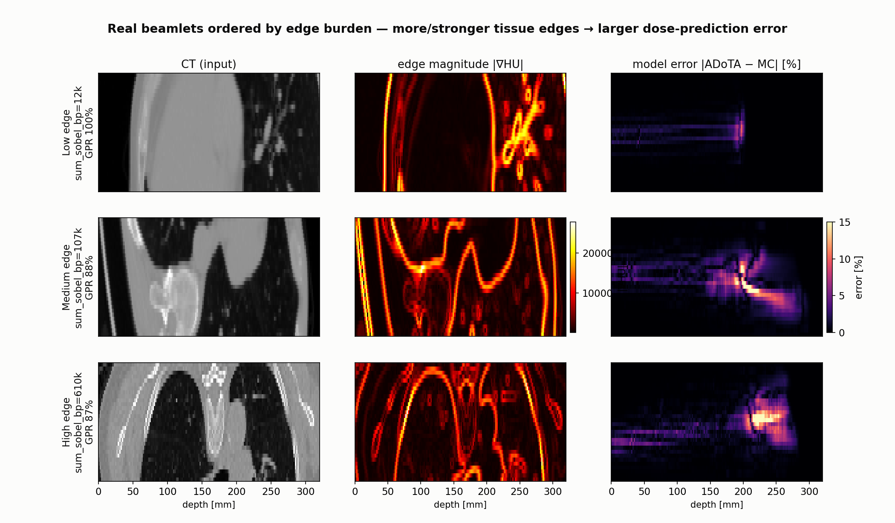

**Figure 8.** Three real beamlets ordered by increasing edge burden `sum_sobel_bp`. Each row shows, from left to right, the computed-tomography image, the Sobel edge magnitude, and the absolute dose error in percent. The clean beamlet (`sum_sobel_bp` of 12,000) is predicted almost perfectly at a gamma pass rate of 100 percent, whereas the edge-heavy beamlets (107,000 and 610,000) fall to gamma pass rates near 87 to 88 percent, with the error concentrated on the tissue boundaries near the Bragg peak.

#### 2.3.4 Interface severity

The interface severity index (ISI) counts and weights the tissue-class interfaces along the beam. The one-dimensional density profile $H_s$ of Section 2.3.1 is segmented into Schneider tissue classes, each class is assigned a relative stopping power, and a severity equal to the squared difference of relative stopping powers is summed over every consecutive change of tissue class along the path. The metric `isi_sum` is the total severity, `isi_max` is the severity of the worst single interface, `isi_mean` is the average severity per interface, and `isi_axial_sum` restricts the sum to interfaces crossed along the beam direction. The interface severity index is thus an interface-counting complement to the Sobel edge energy of Section 2.3.3, and the two families are strongly correlated, as Section 2.4 shows.

#### 2.3.5 Lateral spread and range

The metric `lateral_hu_var_bp` is the flux-weighted variance of the CT value across the beam at the Bragg-peak slice, measuring the lateral density spread at the most sensitive depth. The metrics `bp_range_min_mm` and `bp_range_max_mm` are the proximal and distal boundaries of the Bragg-peak zone in millimetres, the depths at which the integrated depth-dose profile falls to 50 percent of its maximum on the proximal side and to 10 percent on the distal side. On the reference set that profile came from the Monte Carlo dose; in deployment it comes from the analytic dose of the Erratum (item 4), which places the peak from the beam energy through the range-energy relation and the per-ray water-equivalent depth. The metric `max_grad_depth_mm` is the depth of the steepest gradient of the integrated depth-dose profile, that is the proximal rise of the Bragg peak (corrected, see Erratum, item 2).

### 2.4 Reduction of the metric set

The metric set is reduced from about thirty metrics to fourteen in two steps: redundant metrics are removed, and then only the metrics that improve the fit are retained. Each step is presented first on a small illustrative example, then as a method, then on the reference data.

#### 2.4.1 Removal of redundant metrics

Many metrics measure the same underlying physical quantity and are therefore near-duplicates. Figure 9 illustrates the principle on six toy metrics that describe only three distinct quantities. If all six were used, the quantity measured three times would dominate the score merely because it was measured more often. The remedy is to group metrics that vary together and keep one representative per group.

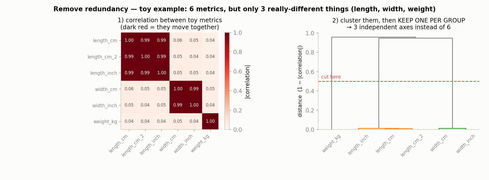

**Figure 9.** Illustration of redundancy removal on six toy metrics that measure only three distinct quantities: a length measured by three rulers, a width measured in two units, and a weight. Left: the correlation between the six metrics, showing two strongly correlated blocks (length and width) and one independent metric (weight). Right: hierarchical clustering groups the metrics into three clusters, from which one representative each is kept, reducing six metrics to three independent axes.

The method computes, for every pair of metrics $i$ and $j$, the Spearman rank correlation $\rho_{ij}$, and defines a distance $D_{ij}=1-\lvert\rho_{ij}\rvert$, so that metrics that vary together are close. Hierarchical clustering with average linkage groups the metrics, cutting the resulting dendrogram at a fixed height yields the clusters, and from each cluster the metric most correlated with the regression target is retained. Applying this method to the thirty reference metrics produces the block structure of Figure 10: a water-equivalent-path-length block, a density-variation block, a large block combining the edge and interface-severity metrics, an anisotropy pair, and a few singletons.

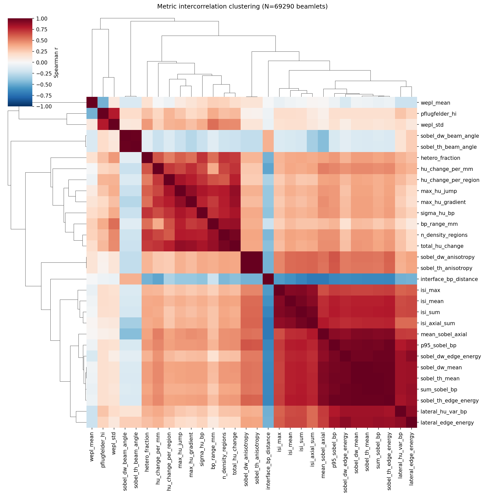

**Figure 10.** Correlation between the thirty input metrics on the reference set, ordered by hierarchical clustering. Each dark square is a group of metrics that vary together and are therefore effectively duplicates; the visible blocks correspond to the water-equivalent path length, the density-along-the-beam metrics, the combined edge and interface-severity metrics, and an anisotropy pair. One representative metric is kept per block.

#### 2.4.2 Selection of the metrics that improve the fit

The de-duplicated metrics are then entered into the regression with an added penalty per metric used, which forces the fit to drop the metrics that contribute least. Figure 11 illustrates this on a toy regression in which two metrics are informative, one is a redundant copy, and three are noise; the penalty drives the redundant copy and the three noise metrics to exactly zero weight.

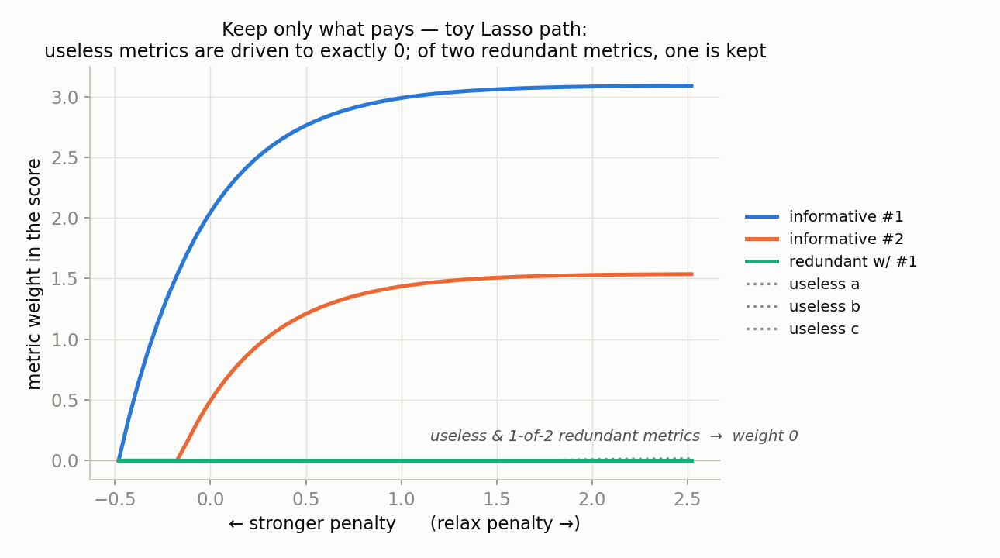

**Figure 11.** Illustration of metric selection by the least absolute shrinkage and selection operator (Lasso) on a toy regression. The horizontal axis is the penalty strength, decreasing from left to right. As the penalty relaxes, the two informative metrics enter the score one by one, whereas the redundant copy and the three noise metrics remain at exactly zero weight. The Lasso therefore keeps only the metrics that improve the fit and, of two redundant metrics, keeps one.

The method is the Lasso fit of Section 2.2, which minimizes the squared error plus $\alpha\lVert w\rVert_1$. The absolute-value penalty drives small weights to exactly zero, so increasing the penalty strength $\alpha$ removes metrics from the score. Sweeping $\alpha$ traces the relationship between the number of metrics retained and the achieved correlation, which Figure 12 reports for the reference data. A single metric already yields a Spearman correlation near 0.72; fourteen metrics reach 0.80; all thirty reach 0.86. The 14-metric score is retained as the interpretable default, and the 30-metric and non-linear versions are kept as accuracy references, as summarized in Section 2.6.

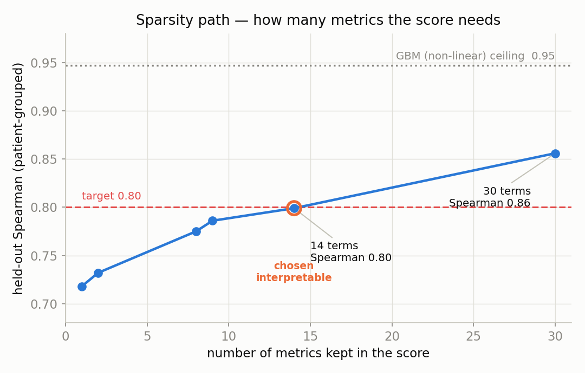

**Figure 12.** Held-out Spearman correlation with the relative dose error as a function of the number of metrics retained in the linear score, under patient-grouped cross-validation. Accuracy rises steeply for the first metrics and then flattens: one metric reaches 0.72, fourteen metrics reach the target of 0.80, and thirty metrics reach 0.86. The dotted line marks the correlation of a non-linear reference model. The 14-metric score is retained as the interpretable default.

### 2.5 Error targets and evaluation protocol

The regression target $y(x)$ is a measure of the model error, evaluated only on the already-simulated reference set. Three error measures are considered. The relative dose error (RDE) is the mean absolute dose error normalized by the maximum dose. The gamma pass rate (GPR) is the percentage of voxels at which prediction and ground truth agree within 3 percent and 3 mm and is the clinically primary quality measure. The range error is the absolute difference in the distal range, in millimetres, between prediction and ground truth. The mean absolute percentage error (MAPE) normalizes the dose error voxel by voxel by the local dose, evaluated within a dose mask that retains voxels above a fraction of the maximum ground-truth dose; masks of 5 percent and 10 percent are used, because the per-voxel normalization is otherwise dominated by low-dose voxels.

Because the difficulty score is fitted by squared-error regression, the target is transformed to stabilize its heavy right tail. The score is regressed against $y=\log(1+\mathrm{RDE})$; the transform $\log(1+\cdot)$ is monotonic and therefore preserves the ranking of the target, so it mainly improves the Pearson correlation of the linear fit, whereas because the score is re-fitted to the transformed target the Spearman correlation may change slightly (Section 3.2). The quality of a candidate score is reported by two correlations with the true error on held-out patients: the Pearson correlation, which measures linear agreement, and the Spearman correlation, which measures rank agreement. Section 2.6 uses these two correlations to compare the score variants, and Section 3.1 uses them to compare the error targets.

The two correlations and their estimator are defined as follows. Given held-out beamlets $i=1,\dots,n$ with predicted scores $\hat{s}_i$ and true errors $y_i$, the Pearson correlation is

$$
r \;=\; \frac{\sum_{i}(\hat{s}_i-\bar{\hat{s}})(y_i-\bar{y})}{\sqrt{\sum_{i}(\hat{s}_i-\bar{\hat{s}})^{2}}\;\sqrt{\sum_{i}(y_i-\bar{y})^{2}}},
$$

where $\bar{\hat{s}}$ and $\bar{y}$ are the sample means. The Spearman correlation $\rho$ is the same quantity computed on the ranks of $\hat{s}_i$ and of $y_i$: it measures monotone rather than linear agreement and is therefore invariant to any monotone transform of either variable. Both are estimated by patient-grouped five-fold cross-validation. The patients are partitioned into five folds; for each fold $f$ the model is fitted on the other four folds and the correlation $c_f$ is evaluated on the held-out fold, and the reported value is the mean over folds, $\bar{c}=\tfrac{1}{5}\sum_{f=1}^{5}c_f$. Grouping by patient forces all beamlets of a patient into the same fold, so the estimate is not inflated by the similarity of beamlets within a patient. The same estimator is applied to every model in this report, whether linear or non-linear, so that the correlations are directly comparable.

### 2.6 Model classes and score variants

Two model classes are used throughout the report. The first is the linear score of Section 2.2, a weighted sum of the percentile-normalized metrics; it is the model that is deployed, because its weights are directly interpretable. The linear score has a structural limitation: as a sum of per-metric contributions it treats the metrics additively and monotonically, so it cannot represent an effect that exists only in the *combination* of two metrics, nor a response that rises and then saturates. The second model class, the non-linear reference, exists to measure how much such structure the inputs contain, and therefore how much correlation is being left unused by the linear form.

The non-linear reference is a gradient-boosted ensemble of regression trees. A regression tree $T(x)$ partitions the metric space by a sequence of threshold splits and predicts a constant in each resulting region. The ensemble is an additive model of $M$ such trees,

$$
F_M(x) \;=\; F_0 \;+\; \nu \sum_{m=1}^{M} T_m(x),
$$

built greedily: starting from a constant $F_0$, each new tree $T_m$ is fitted to the negative gradient of the squared-error loss at the current predictions, that is to the residuals $y_i - F_{m-1}(x_i)$, and is added with a small learning rate $\nu$ that shrinks its contribution and regularizes the fit. Because a single tree splits on several metrics in succession, the ensemble represents interactions between metrics and non-monotone responses, which is exactly what the linear score cannot do. Figure 13 illustrates this on an idealized two-feature problem in which the target depends only on the interaction of the features: the linear model reaches a held-out correlation of zero while the tree ensemble recovers the pattern.

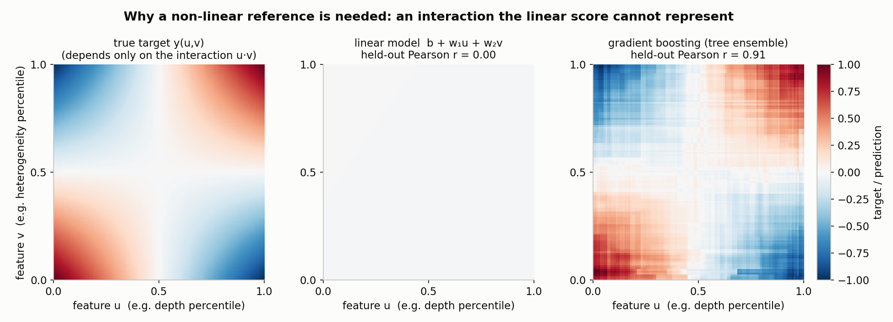

**Figure 13.** Idealized illustration of why the non-linear reference can exceed the linear score. Two features $u,v$ are drawn uniformly on $[0,1]$ and the target depends only on their interaction, $y = 4\,(u-\tfrac12)(v-\tfrac12)$, so that neither feature has any effect on its own. Left: the true target, a four-quadrant checkerboard. Middle: the best linear model $b+w_1 u + w_2 v$ is nearly constant and reaches a held-out Pearson correlation of 0.00, because a sum of per-feature effects cannot represent an interaction. Right: the gradient-boosted tree ensemble recovers the pattern and reaches 0.91. The gap between the fitted linear score and the non-linear reference on the real metrics in Section 3 is the same effect.

The non-linear reference is fitted on the same percentile-normalized metrics and evaluated under the same patient-grouped cross-validation as the linear score, so the two are directly comparable. It uses $M=300$ trees and a learning rate $\nu=0.05$, in the histogram-based implementation of scikit-learn (`HistGradientBoostingRegressor`), which bins each metric before searching for splits and is fast on the reference set. Because it has far more effective parameters than the linear score, it is used only as an upper reference on the correlation attainable from the given inputs; it is never deployed as the difficulty score, because it exposes no weights to inspect and no physical sign to verify, both of which the linear score provides and both of which are required of a defensible selection rule.

Three variants of the score are fitted, spanning a trade-off between accuracy and interpretability, and are defined in Table 3; their correlations with the relative dose error are reported with the results in Section 3.2. The sparse variant is the 14-metric Lasso fit and is the interpretable default. The full linear variant is the 30-metric ridge fit and is the most accurate linear score. The non-linear variant is the gradient-boosted regression-tree ensemble just described and provides an upper reference for the achievable accuracy.

**Table 3.** The three variants of the difficulty score. The number of terms is the number of input metrics with non-zero weight. The correlations achieved by each variant are reported in Table 5.

| Variant | Number of terms | Role |
|---|---|---|
| Sparse linear (Lasso) | 14 | interpretable default |
| Full linear (ridge) | 30 | most accurate linear score |
| Non-linear (gradient boosting) | all 30 | accuracy upper reference |

---

## 3. Results

### 3.1 Which error is predictable from the inputs

No single input metric is sufficient on its own, which is what motivates combining the metrics by a fit rather than selecting one. Figure 14 ranks, for each error measure, the individual metrics by their Spearman rank correlation with that error, computed on the development pool. For the relative dose error the strongest single metric is the beam range `bp_range_max_mm` at a Spearman correlation of 0.74, followed by the density-variation metrics between 0.40 and 0.64; the range alone therefore leaves a large part of the ranking unexplained, and it is in any case largely a beam-depth effect. For the mean absolute percentage error and for the gamma pass-rate error no single metric exceeds 0.35, and the leading metrics are the edge- and spread-based measures. Fitting a weighted combination of all metrics raises the correlation above any single metric in every case, from 0.74 to 0.85 for the relative dose error, from 0.35 to 0.65 for the mean absolute percentage error, and from 0.33 to 0.49 for the gamma pass-rate error, with a non-linear model higher still. The combination is therefore necessary, and this motivates the fitted score; the remainder of this section quantifies how far the fit can go.

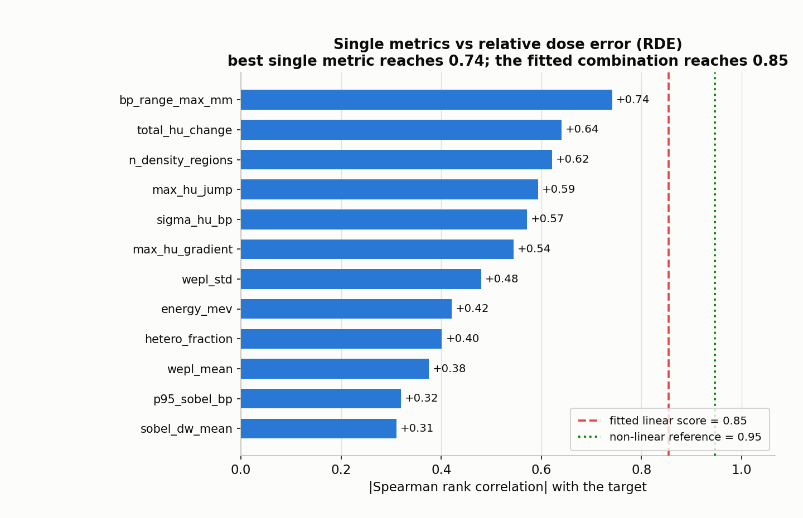

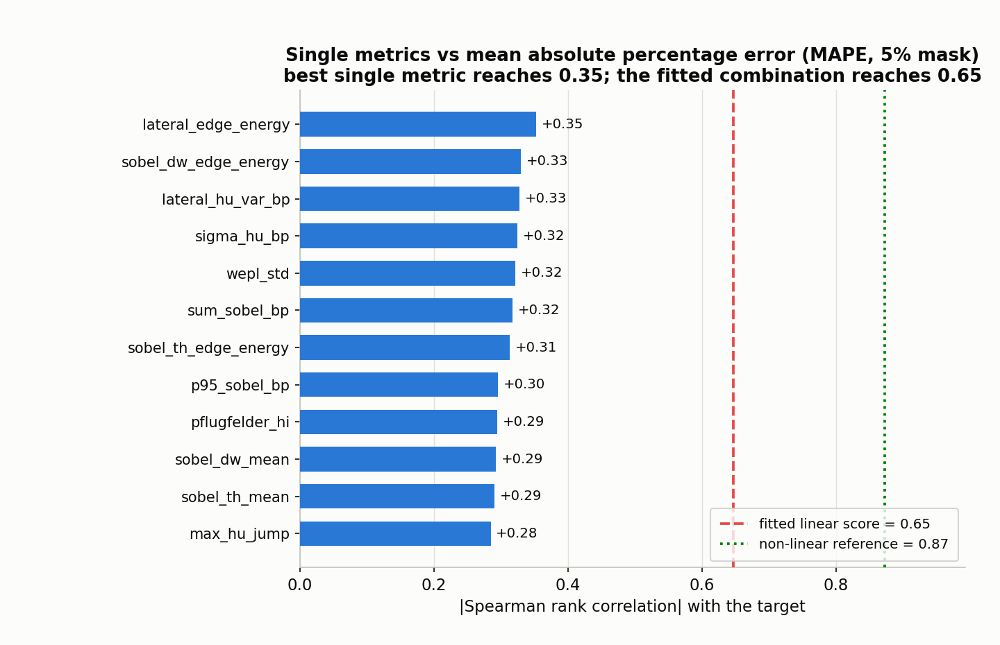

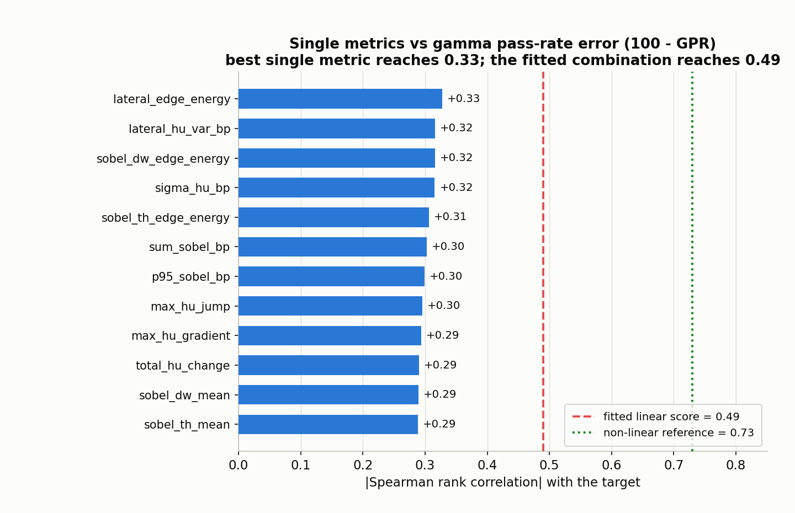

**Figure 14.** Spearman rank correlation of each individual input metric with the model error, on the development pool of 49 patients, for the twelve most correlated metrics per target. (a) Relative dose error: the strongest single metric is the beam range at 0.74. (b) Mean absolute percentage error within the 5 percent dose mask: no single metric exceeds 0.35. (c) Gamma pass-rate error, defined as 100 minus the gamma pass rate: no single metric exceeds 0.33. In each panel the red dashed line marks the correlation of the fitted linear combination of all metrics and the green dotted line that of the non-linear reference, both under patient-grouped cross-validation; the fit exceeds every single metric.

The amount of predictable signal differs strongly between the error measures, and this determines the target of the score. Figure 15 reports, for each error measure, the correlation achieved by a regression on all input metrics under patient-grouped cross-validation on the development pool of 49 patients, for both a linear model and the non-linear reference. The relative dose error is predictable to a Pearson correlation of 0.85 with the linear model and 0.95 with the non-linear reference, and therefore exceeds the target of 0.80. The gamma pass rate reaches only 0.71, and the range error only 0.52. The relative dose error result is not merely a consequence of beam depth, because it remains at 0.82 when the energy-related and range-related metrics are removed, and is therefore driven by tissue heterogeneity. The relative dose error is consequently adopted as the regression target. An alternative dose-error definition, the mean absolute percentage error, was also evaluated as a target and is reported together with the score performance in Section 3.2.

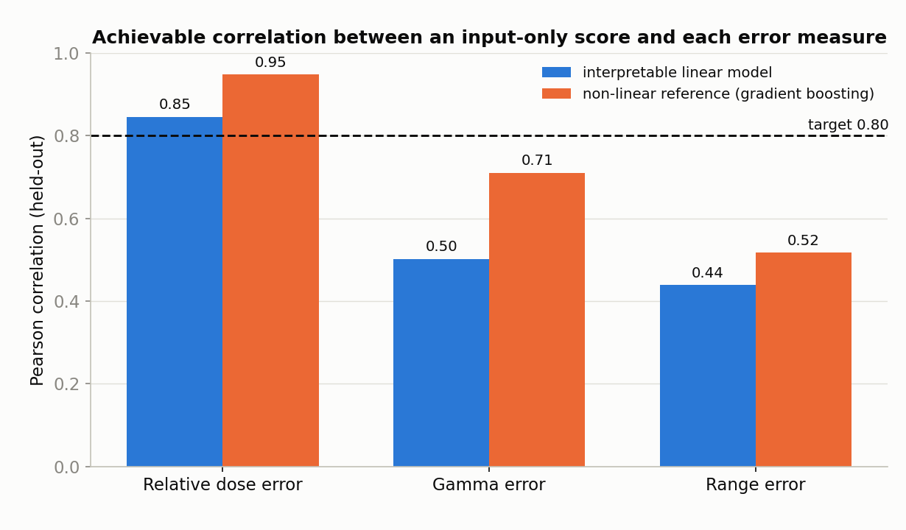

**Figure 15.** Achievable correlation between an input-only score and each measure of model error, under patient-grouped cross-validation on the development pool of 49 patients. For each error measure the two bars give the Pearson correlation of an interpretable linear model and of a non-linear gradient-boosting reference. The relative dose error exceeds the target of 0.80 (dashed line), the gamma pass rate reaches 0.71, and the range error reaches 0.52.

### 3.2 Performance of the difficulty score

The difficulty score predicts the relative dose error strongly. Figure 16 shows the predicted score against the true relative dose error for the development pool under five-fold patient-grouped cross-validation; the full linear score reaches a Pearson correlation of 0.85 and a Spearman correlation of 0.86, and the point cloud follows the identity line.

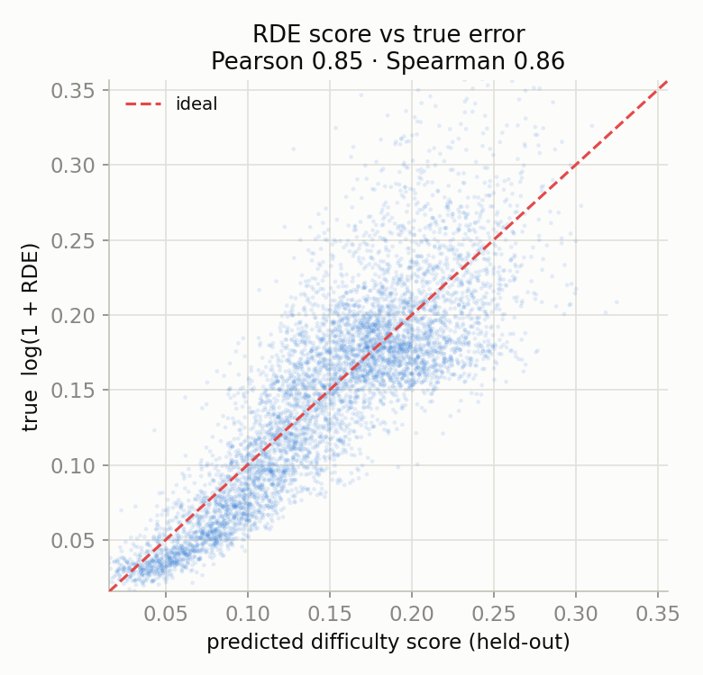

**Figure 16.** Predicted difficulty score against the true relative dose error for held-out beamlets of the development pool, under five-fold patient-grouped cross-validation. Each point is a beamlet. The point cloud follows the identity line, corresponding to a Pearson correlation of 0.85 and a Spearman correlation of 0.86.

The dependence of the achievable correlation on the error definition, the target transform and the model class is summarized in Table 4, and three conclusions follow. First, the relative dose error is the only target that the interpretable linear score predicts to the target correlation of 0.80; the mean absolute percentage error is predicted only to a Pearson correlation of 0.63 to 0.65 by the linear score, although the non-linear reference reaches 0.85 to 0.87, depending on the dose mask. Second, the mean absolute percentage error and the relative dose error are moderately correlated, with Spearman correlations of 0.58 and 0.52 for the 5 percent and 10 percent dose masks respectively, so they measure related but distinct aspects of the error: the relative dose error normalizes by the maximum dose, whereas the mean absolute percentage error normalizes voxel by voxel by the local dose. Third, the logarithmic transform improves the Pearson correlation for every target and, for the more strongly skewed mean absolute percentage error, improves the Spearman correlation slightly as well, because the score is re-fitted to the transformed target.

**Table 4.** Held-out correlations with each dose-error target under patient-grouped cross-validation on the development pool of 49 patients, for the interpretable linear score and the non-linear gradient-boosting reference, and for the untransformed and the logarithmically transformed target. The mean absolute percentage error (MAPE) is evaluated within a dose mask that retains voxels above 5 percent or 10 percent of the maximum ground-truth dose. The relative dose error (RDE) is the only target the linear score predicts to the target correlation of 0.80.

| Target | Transform | Linear Pearson | Linear Spearman | Non-linear Pearson | Non-linear Spearman |
|---|---|---|---|---|---|
| Relative dose error | raw | 0.834 | 0.854 | 0.942 | 0.946 |
| Relative dose error | $\log(1+\cdot)$ | 0.846 | 0.854 | 0.948 | 0.947 |
| Mean absolute percentage error, 5 percent mask | raw | 0.630 | 0.647 | 0.848 | 0.873 |
| Mean absolute percentage error, 5 percent mask | $\log(1+\cdot)$ | 0.651 | 0.660 | 0.868 | 0.876 |
| Mean absolute percentage error, 10 percent mask | raw | 0.617 | 0.628 | 0.835 | 0.855 |
| Mean absolute percentage error, 10 percent mask | $\log(1+\cdot)$ | 0.635 | 0.641 | 0.854 | 0.858 |

The performance was confirmed on the frozen test set of unseen patients. Table 5 reports the correlations of the three variants both on the development pool and on the frozen test set of seven patients, evaluated once with the frozen weights. The test correlations equal the development cross-validation to within noise for every variant, so the development estimate is not inflated by the selection of the target, the penalty strength or the metric set, and the score generalizes to patients that were excluded from fitting entirely. When the score is instead trained on one anatomical region and evaluated on the other, the correlation decreases to about 0.71 but does not collapse, which bounds the harder case of transfer to an unseen anatomy.

**Table 5.** Correlations of the three score variants with the relative dose error, comparing the five-fold patient-grouped cross-validation on the development pool of 49 patients (61,352 beamlets) with the single evaluation on the frozen test set of 7 unseen patients (7,938 beamlets). The two evaluations agree for every variant, which confirms that the score generalizes to unseen patients and that the development estimate is not optimistic.

| Variant | Number of terms | Development Pearson | Development Spearman | Frozen-test Pearson | Frozen-test Spearman |
|---|---|---|---|---|---|
| Sparse linear (Lasso) | 14 | 0.787 | 0.794 | 0.791 | 0.817 |
| Full linear (ridge) | 30 | 0.845 | 0.853 | 0.852 | 0.864 |
| Non-linear (gradient boosting) | all 30 | 0.947 | 0.947 | 0.945 | 0.947 |

### 3.3 Physical interpretation of the score

The score admits a direct physical reading, which supports its use as a selection rule. Figure 17 shows the weights of the interpretable 14-metric score. The score is dominated by two physical effects: the beam path length, through the range and depth metrics, and the amount of density variation along the path, through the density-change and edge metrics. All weights carry the physically expected sign. The relative dose error therefore grows with how far the beam travels and with how heterogeneous the traversed path is, which is consistent with the mechanism illustrated in Figures 6 and 8.

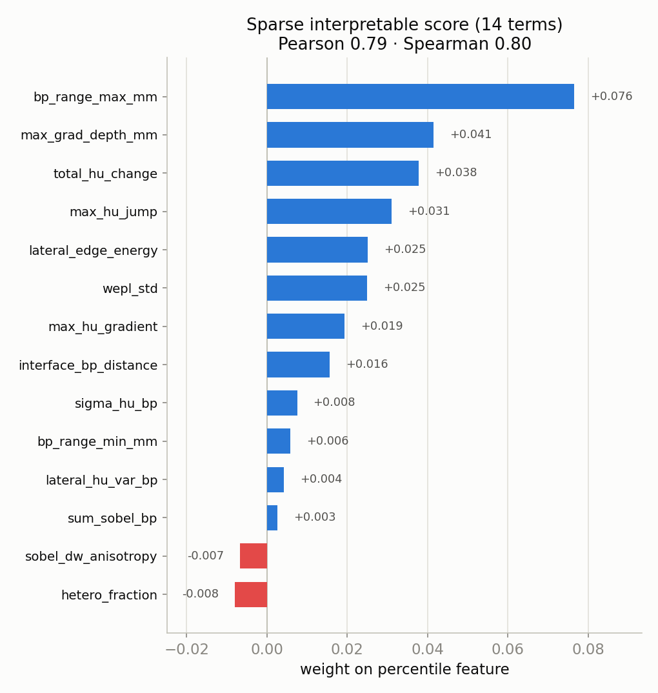

**Figure 17.** Weights of the interpretable 14-metric difficulty score, sorted by magnitude. The largest contributions come from the beam range and depth metrics and from the density-change and edge metrics, all with the physically expected sign, so that a larger score corresponds to a longer and more heterogeneous beam path.

---

## 4. Discussion

The principal result is that a single input-only score predicts the continuous relative dose error on unseen patients to a Pearson correlation of 0.85, which is strong enough to rank beamlets for active-learning selection, and that the score is physically interpretable. This result was confirmed on a frozen test set of seven patients that were excluded from all fitting and model selection (Section 3.2), so it is not an artifact of choosing the target, the penalty strength or the metric set on the same data. Four limitations qualify this result and define the scope of the claim.

First, the gamma pass rate, which is the clinically primary quality measure, is predictable only to a correlation of 0.71, short of the target. An additional input-only metric was implemented to close this gap, motivated by the case in which one part of the beam passes through bone and another through air; the metric measures the water-equivalent-path-length difference between the two halves of the beam footprint. On a subset of 11,500 beamlets from 55 patients this metric proved strongly correlated with the existing water-equivalent-path-length spread, with a Spearman correlation of 0.92, and raised the gamma-pass-rate ceiling by only 0.02, from 0.705 to 0.725. The spatial arrangement it captures therefore co-occurs with the water-equivalent-path-length scatter and adds little independent signal for the gamma pass rate.

Second, a high correlation with the relative dose error is not identical to usefulness for active learning. The relative dose error score concentrates the worst gamma-pass-rate cases only about 1.7 times better than random selection in the top decile, whereas a model trained directly to flag gamma-pass-rate failures concentrates them about 6.3 times better. Predicting the magnitude of the dose error and selecting the worst gamma-pass-rate cases are therefore related but distinct objectives.

Third, there is a trade-off between accuracy and interpretability. The interpretable 14-metric score reaches a correlation of 0.80, whereas reaching 0.85 requires all thirty metrics, whose individual weights are then no longer cleanly interpretable because the metrics remain partly correlated.

Fourth, the reference set spans only two anatomical regions, the thorax and the pelvis or abdomen, so the cross-anatomy generalization reported in Section 3.2 is indicative rather than conclusive; additional anatomical regions are required to establish it.

---

## 5. Conclusion and future work

An input-only difficulty score built from physics-motivated heterogeneity metrics predicts the relative dose error of the ADoTA proton-dose model on unseen patients to a Pearson correlation of 0.85 and a Spearman correlation of 0.86, and an interpretable 14-metric version reaches 0.80. The score is physically interpretable and, in the input-only form of the Erratum (item 4), computable before any Monte Carlo simulation, and is therefore suitable as a selection rule for active learning. The gamma pass rate, in contrast, is predictable only to 0.71, because the errors it captures concentrate in a small tail that the static physics metrics do not fully explain.

The next signal to add is the model's own predictive uncertainty, obtained for example from Monte Carlo dropout, which is also computable from the inputs alone and is independent of the static physics metrics. It is the natural candidate to raise the gamma-pass-rate correlation toward the target and to improve the active-learning selection, and it is the recommended next experiment.

---

## Data and code availability

The non-linear-reference illustration of Figure 13 was produced by `scripts/analysis/plot_nonlinear_toy.py`. The single-metric correlations of Figure 14 were computed by `scripts/analysis/acquisition_single_metric_corr.py`. The achievability correlations of Figure 15 and the target comparison of Table 4 were computed on the development pool, with the frozen-test patients removed, by `scripts/analysis/acquisition_dev_analysis.py`; the exploratory scripts `scripts/analysis/acquisition_regression_study.py` and `scripts/analysis/acquisition_target_comparison.py` compute the same quantities over the full reference set. The final score and Figure 16 were produced by `scripts/analysis/acquisition_rde_finalize.py`, and the per-beamlet mean absolute percentage error by `scripts/analysis/extract_mape.py`. The frozen-test verification of Table 5 was produced by `scripts/analysis/acquisition_frozen_test.py`, which stores the frozen test sample identifiers (`frozen_test_ids.csv`), the final weights and percentile grids (`frozen_final_scorer.json`), and the summary (`frozen_test_results.csv`) under `.../figures/acquisition/`. The per-family metric figures (Figures 4 and 5) were produced by `scripts/analysis/plot_metric_families.py`, the water-equivalent-path-length examples (Figure 6) by `scripts/analysis/plot_wepl_examples.py`, the edge phantoms (Figure 7) by `scripts/analysis/plot_edge_phantoms.py`, the real edge examples (Figure 8) by `scripts/analysis/plot_edge_gradient_examples.py`, the redundancy and sparsity illustrations (Figures 9 and 11) by `scripts/analysis/plot_toy_selection.py`, the sparsity path (Figure 12) by `scripts/analysis/plot_sparsity_path.py`, and the beamlet views (Figures 1 and 6) by `src/figures/single_beam.py`. The metric clustering (Figure 10) was produced by the advanced-metrics pipeline. The analytic dose, the input-only feature computation, the deployed score (`src/acquisition/data/analytic_scorer.json`) and the single-call candidate scorer of the Erratum are in `src/acquisition/`; the validation against the reference set is `scripts/analysis/acquisition_input_only_{features,compare,refit}.py`, with its outputs under `/scratch/mstryja/adota_runs/acquisition_input_only/full` and its record in EXP-0006. The reference run is stored at `/scratch/mstryja/adota_runs/20260707_124010` and comprises 69,290 beamlets from 56 patient computed-tomography scans of the thorax and the pelvis or abdomen.
